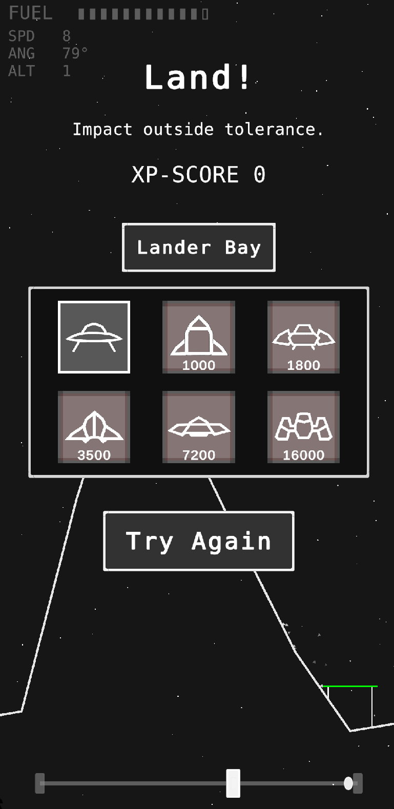

# This Ain't Moon Lander

**This Ain't Moon Lander** is a lunar-landing prototype that combines piloting, EVA exploration and landing challenges.

## Highlights
- Select and pilot different landers.
- Moon-surface astronaut exploration.
- Gravity, landing-pad placement and scoring systems.
- Story and local save support.

## Development
- **Engine:** Unity 6000.0.59f2
- **Status:** Waiting

## Game concept

The detailed story, progression and long-term vision are documented in [GAME_CONCEPT.md](GAME_CONCEPT.md).

## Run locally
1. Clone the repository.
2. Open it in Unity Hub with the listed Unity version.
3. Open a scene in `Assets/Scenes` and press Play.
